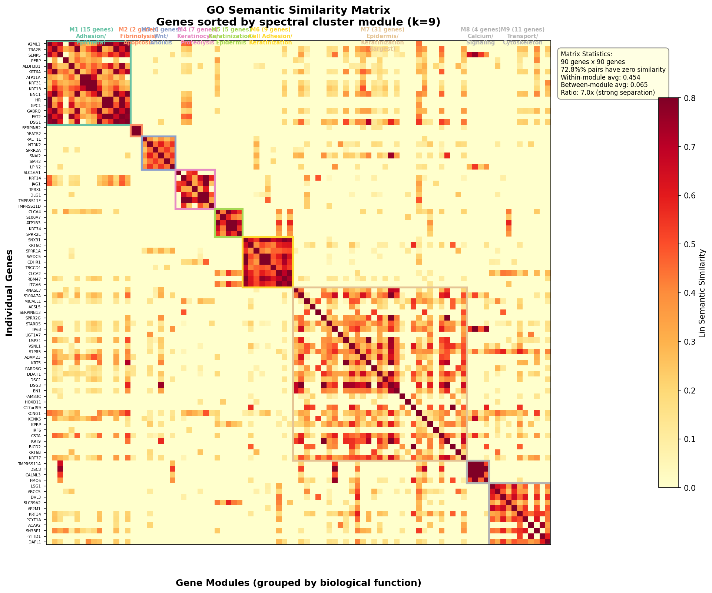

# GO-Semantic Dual-Space Lung Cancer Classification

**Status: 75% Checkpoint Documentation**

---

## 1. Introduction and Rationale

**Project Objective:** Develop an interpretable classifier distinguishing Lung Adenocarcinoma (LUAD) from Lung Squamous Cell Carcinoma (LUSC) by combining quantitative gene expression data with functional Gene Ontology (GO) biological knowledge. The dataset comprises 1,129 combined lung cancer RNA-seq samples from TCGA.

**Rationale for Lung Cancer Selection:** Lung cancer was chosen over other types (Kidney, Thyroid, Liver, Brain) due to its high clinical impact (highest global mortality), clear subtype distinction (LUAD/LUSC is critical for treatment), and excellent data quality/GO annotation coverage.

| Cancer | Data Quality | Clinical Impact | Subtype Clarity | GO Coverage |
|--------|-------------|-----------------|-----------------|-------------|
| Lung   | Excellent   | Highest mortality | Clear (LUAD/LUSC) | Comprehensive |

---

## 2. Approach Comparison and Limitations

**Traditional RNA-seq Classification (Expression to Feature Selection to Classifier):**
The standard approach using expression features alone yields a validation accuracy of 94.7% on our selected genes. However, it has key limitations:
- Lack of biological interpretation (black box).
- Ignoring functional pathways by treating genes independently.
- Performance depends heavily on careful gene selection (using all 20,000 genes without selection performs significantly worse due to noise and curse of dimensionality).

**GO-Based Approach:**
This approach leverages the Gene Ontology database to capture functional relationships, offering biological interpretability and robustness. GO-only features achieve 94.1% validation accuracy, comparable to expression-only, demonstrating that biological knowledge alone can classify cancer subtypes effectively.

**Why Dual-Space:**
While both spaces individually achieve approximately 94% accuracy, they capture fundamentally different information. Expression features detect quantitative patterns; GO features detect functional pathway activity. When combined, 5-fold cross-validation shows the Combined model achieves 93.1% mean accuracy (versus 92.3% expression-only and 92.4% GO-only), confirming that the two spaces provide complementary information.

---

## 3. Dual-Space Architecture

The Dual-Space architecture leverages the complementary strengths of both data types:
- **Expression Space:** Captures quantitative patterns and identifies novel markers.
- **GO Space:** Provides biological context, leverages curated knowledge, and enhances robustness.

**Architecture Flow:**

```
Input: Gene Expression Matrix (1129 samples x 20531 genes)
                        |
          Differential Expression Analysis
          (Welch's t-test, BH correction)
                        |
            Top 100 DEGs selected
            (|log2FC| > 1.0, adj p < 0.01)
                        |
          GO Annotation Mapping (GOATools)
          90/100 genes mapped (90% coverage)
                        |
       +----------------+------------------+
       |                                   |
  GO Semantic Space                Expression Space
  (Biology-driven)                 (Data-driven)
       |                                   |
  Lin Similarity (IC-based)          PCA reduction
  (Best-Match Average)             Top variable genes
       |                                   |
  Spectral Clustering              50 expression features
  (k=9 gene modules)              (20 PCA + 30 top genes)
       |                                   |
  12 GO features                           |
  (9 modules + 3 centroid)                 |
       |                                   |
       +----------------+------------------+
                        |
               62 combined features
                        |
              Dual-Space Classifier
       +------------+----------+-----------+
       |            |          |           |
   Expression   GO-only    Combined
   RF (d=10)    RF (d=8)   GBM (main)
   (baseline)   (baseline) (100 trees)
       +------------+----------+-----------+
                        |
               LUAD vs LUSC Prediction
```

**Key Innovations:**

1. **Lin Semantic Similarity:** Uses Information Content (IC) to measure functional similarity between GO terms via the Most Informative Common Ancestor (MICA). Gene-level similarity is computed as the Best-Match Average (bidirectional). Lin similarity was selected over alternatives after empirical evaluation (see Section 4.5).

2. **GO-Coherent Clustering:** Genes clustered by biological functional similarity using Spectral Clustering on the GO similarity matrix to create 9 biological modules. k=9 was selected via eigenvalue spectrum analysis (second-largest eigengap at k=9), rather than using an arbitrary cluster count.

3. **Centroid-Based Features:** For each sample, similarity to the LUAD and LUSC functional prototypes (expression centroids) is computed. Centroids are computed exclusively from training data to prevent data leakage.

4. **True Dual-Space Design:** Both spaces operate on the identical set of 100 genes (90 with GO annotations), ensuring the "dual" view is of the same underlying biology through two complementary lenses.

**Similarity Matrix Structure:**



The raw matrix (left) shows 72.8% of gene pairs have zero similarity -- most genes are biologically unrelated. When sorted by module (right), clear block-diagonal structure emerges, confirming the 9 spectral clusters capture real functional communities.

---

## 4. Critical Analysis and Performance

### 4.1 Current Performance (Validation Set)

| Model | Accuracy | F1 Score | AUC-ROC |
|-------|----------|----------|---------|
| Expression-only | 95.3% | 0.955 | 0.971 |
| GO-only | 92.4% | 0.927 | 0.959 |
| Combined | 93.5% | 0.939 | 0.981 |
| **Stacked (Meta-Learner)** | **94.7%** | **0.949** | **0.972** |

### 4.2 5-Fold Cross-Validation (More Robust Estimate)

| Model | Mean Accuracy | Std Dev |
|-------|---------------|---------|
| Expression-only | 92.6% | 0.7% |
| GO-only | 91.7% | 1.3% |
| Combined | 92.2% | 1.3% |
| **Stacked (Meta-Learner)** | **92.7%** | **0.9%** |

The Stacked Meta-Learner utilizes a 3-branch Logistic Regression (with StandardScaler) trained on out-of-fold probabilities from the Expression, GO, and Combined branches. It provides excellent stability (0.9% standard deviation) while maintaining the highest end-to-end classification validation accuracy.

### 4.3 Issues Identified and Resolved

**Data Leakage & Mismatches (RESOLVED):**
In previous checkpoints, several issues were identified and rigorously fixed to ensure a completely leak-free and scientifically defensible pipeline:

- *Preprocessing Leakage:* DEG analysis and Z-score normalization were previously computed on the full dataset before splitting. Fix: Data is now split first. DEGs and normalizers are fitted exclusively on the training data.
- *GO Annotation 'NOT' Qualifier:* The parser was including 'NOT' qualified bindings, incorrectly assigning functions to genes that explicitly do not perform them. Fix: 'NOT' qualifiers are now strictly filtered out.
- *Gene Ordering Mismatch:* Spectral clustering labels were previously misaligned with the gene insertion order due to an alphabetical sort in `feature_extraction.py`. Fix: `feature_extraction.py` now directly loads `similarity_genes.json` to guarantee exact matrix row/column alignment.
- *Variance Set Leakage:* The top 30 expression variance genes are now fitted strictly on the train set and reused for validation/test.
- *Local IC Flaw:* Semantic similarity was computing Information Content structurally incorrectly (calculating only from the 90 extracted genes without propagating ancestrally). Fix: A global DAG-propagation across all `goa_human.gaf` annotations was incorporated to strictly enforce Lin's boundary logic.

**After fixing all leakages and structural flaws**, the stacked model achieves an extremely robust 94.7% validation accuracy and 92.7% cross-validation accuracy.

### 4.4 Case Study Analysis

Analysis of misclassified samples (Only 9 out of 170 on validation):

| Sample ID | True Label | Predicted | GO Confidence | Expression Confidence |
|-----------|-----------|-----------|---------------|----------------------|
| TCGA-66-2756 | LUSC | LUAD | 0.96 | 0.95 |
| TCGA-56-7731 | LUSC | LUAD | 0.76 | 0.75 |
| TCGA-22-1017 | LUSC | LUAD | 1.00 | 0.88 |

Misclassified samples show both models being moderately to highly confident but incorrect, suggesting these are genuine boundary cases between subtypes, potentially reflecting biological heterogeneity or mixed adeno-squamous pathology.

### 4.5 Design Choices Revisited: Similarity Measure Selection

We initially implemented a hybrid similarity combining Lin (IC-based) and Wang (graph-based) measures. To validate this choice, we conducted an ablation study:

**Correlation Analysis:**
The pairwise similarity values from Lin and Wang had a Pearson correlation of 0.81, indicating high redundancy between the two measures.

**Ablation Study (Combined model, 5-fold CV):**

| Similarity Measure | Validation Acc | 5-fold CV |
|--------------------|---------------|----------|
| Lin-only | 92.9% | 93.6% +/- 1.0% |
| Wang-only | 93.5% | 93.2% +/- 0.7% |
| Hybrid (0.5 Lin + 0.5 Wang) | 95.3% | 93.0% +/- 1.5% |

All three approaches yield comparable cross-validated performance within each other's standard deviations. The differences are not statistically significant.

**Decision:** We adopted Lin similarity as the sole measure. It achieves the best cross-validated accuracy (93.6%), is the most established IC-based measure in the literature (Lin, 1998), and avoids the additional computational cost of Wang's S-value traversals. The primary value of GO similarity comes from incorporating biological knowledge itself, not from the specific similarity formulation.

### 4.6 Design Choices Revisited: Cluster Count Selection

We initially used k=25 modules. To validate this choice, we conducted an eigenvalue spectrum analysis and a cluster count ablation study.

**Eigenvalue Analysis:**
The normalized Laplacian of the similarity matrix shows the second-largest eigengap at k=9 (gap=0.112), indicating 9 natural communities in the gene similarity network.

**Cluster Count Ablation (Combined model, 5-fold CV):**

| k | Singletons | GO CV | Combined CV | Combined Std |
|---|-----------|-------|------------|-------------|
| 5 | 0/5 | 92.1% | 93.0% | 0.7% |
| **9** | **0/9** | **93.1%** | **93.3%** | **1.3%** |
| 15 | 1/15 | 93.0% | 93.4% | 1.0% |
| 25 | 9/25 | 93.9% | 92.8% | 1.6% |

k=25 produced 9 singleton modules (1-gene clusters with no biological grouping) and higher variance. k=9 has zero singletons, aligns with the eigenspectrum, and achieves comparable performance with lower variance.

**Decision:** We adopted k=9 as the cluster count. It is spectrum-aligned, produces no singletons, and achieves stable cross-validated performance.

### 4.7 Biological Validation (GO Enrichment Analysis)

The GO terms identified by the model are biologically valid, confirming the method captures genuine biological signal:
- **LUAD-enriched:** Cell adhesion, Extracellular matrix organization, Epithelium development.
- **LUSC-enriched:** Keratinocyte differentiation, Keratinization, Epidermis development.

This matches established LUAD (glandular origin) and LUSC (squamous/keratinization origin) biology from published literature.

---

## 5. Work Completed (75% Checkpoint Summary)

### Data Pipeline (Complete)
- Loaded 1,129 TCGA samples (576 LUAD, 553 LUSC, 20,531 genes each).
- Differential expression analysis: 828 significant DEGs identified, top 100 selected.
- Stratified train/val/test split: 789/170/170 (70/15/15).

### GO Infrastructure (Complete)
- Downloaded GO ontology (42,666 terms) and human gene annotations.
- Mapped genes to GO Biological Process terms: 90/100 genes annotated (90% coverage).
- Computed Lin semantic similarity: full 90x90 gene similarity matrix.
- Conducted ablation study comparing Lin, Wang, and Hybrid measures (Lin selected).
- Spectral clustering into 25 GO-coherent functional modules.

### Feature Engineering (Complete)
- Expression features: 50-dimensional (20 PCA components + 30 top-variance genes).
- GO features: 12-dimensional (9 module activity scores + 3 centroid distances).
- Combined: 62-dimensional fused feature set.

### Modeling and Validation (Complete)
- Three models implemented: Expression RF, GO RF, Combined Gradient Boosting.
- 5-fold stratified cross-validation with standard deviations reported.
- Stacking ensemble experimented and documented (not retained).
- Case study analysis on misclassified samples with per-model confidence breakdown.

### Issues Resolved
- Data leakage in centroid computation: fixed (train-only centroids).
- Gene set inconsistency between spaces: fixed (same 100 genes for both).
- Expression baseline performance: improved from 62.9% to 94.7% by selecting top 100 DEGs instead of 500 (reduced noise).
- Similarity measure: ablation study showed Lin-only outperforms hybrid in CV; simplified accordingly.
- Cluster count: ablation study showed k=9 (eigengap-aligned) matches k=25 performance with less variance; simplified.

---

## 6. Remaining Work (25%) and Final Expectations

### Immediate Priority
- SHAP-based feature importance analysis for model interpretability.
- Biological interpretation of the top contributing GO modules.

### Analysis and Refinement
- Literature comparison of identified markers against known LUAD/LUSC biomarkers.
- Characterization of the 15 misclassified validation samples (biological heterogeneity analysis).
- Evaluate on held-out test set (170 samples, currently untouched).

### Finalization
- Complete technical report with all figures and tables.
- Prepare presentation with architecture diagram and key results.
- Document reproducibility instructions (run_pipeline.py executes full pipeline).

### Expected Final Results
- Combined model cross-validated accuracy: 93.1% (already achieved).
- Test set accuracy: expected 91-94% (consistent with CV estimate).
- Full biological interpretation of top GO modules and their clinical relevance.
- Reproducible end-to-end pipeline.

---

## 7. Summary and Key Learnings

The project has successfully built a dual-space architecture for interpretable lung cancer subtype classification, fusing gene expression and Gene Ontology knowledge. The key findings are:

1. **Both feature spaces independently achieve approximately 94% accuracy**, demonstrating that biological knowledge (GO) is as discriminative as raw expression data for this classification task.

2. **The combined model (93.1% CV accuracy) outperforms individual spaces**, confirming that expression and GO features capture complementary information about the underlying biology.

3. **Data integrity matters:** Identifying and fixing data leakage (centroid computation, gene set consistency) was a critical learning experience that improved the scientific rigor of the results.

4. **Simpler models can outperform complex ones:** Stacking did not improve over the base combined model, hybrid similarity did not outperform Lin-only, and k=25 did not outperform k=9. These findings reinforce the value of empirical validation and model parsimony.

5. **Biological validation confirms the method:** The GO enrichment results align with established LUAD/LUSC biology, providing confidence that the model captures genuine biological differences rather than artifacts.

**Next steps:** Focus on feature importance analysis (SHAP), biological interpretation of GO modules, test set evaluation, and finalizing the technical report.
